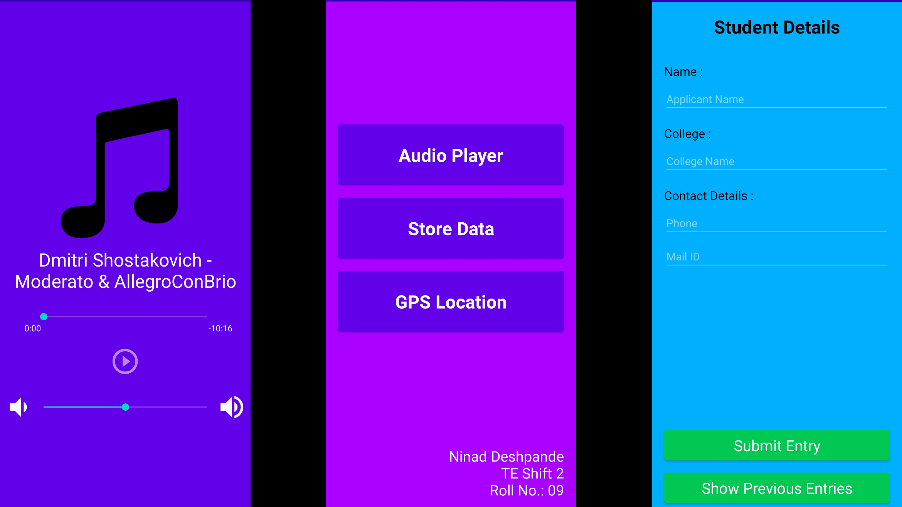
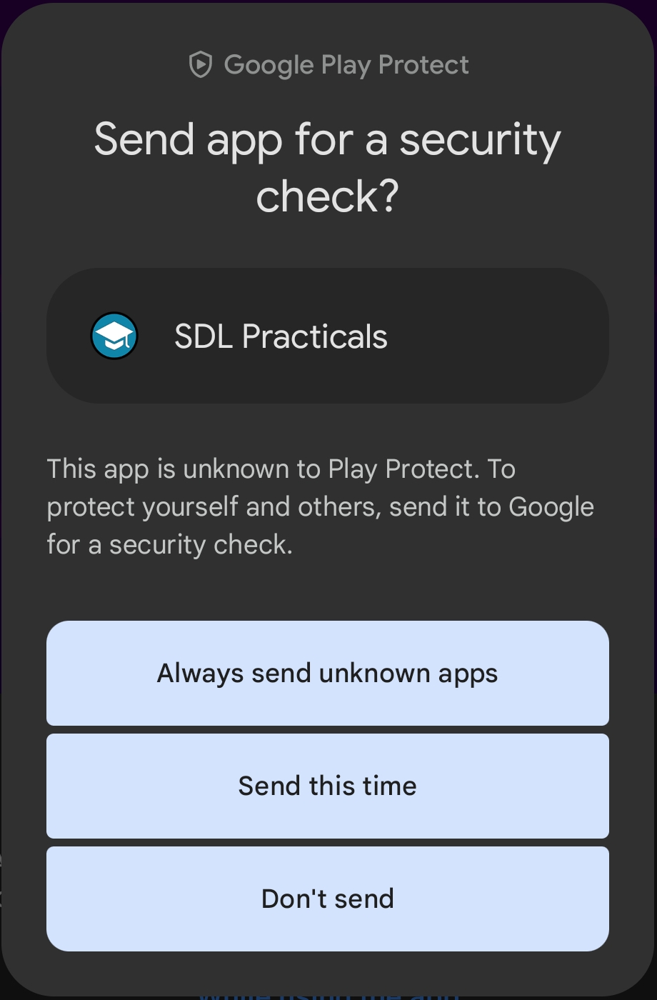

# Skill Development Lab - Practicals (Nov-2020)

Android lab-assignments for 5th semester. Applications contents:
1. Android media player:\
   Plays audio file - (Dmitri Shostakovich - Moderato & Allegro Con Brio)
2. Android (read/write) data storage:\
   Saves and fetches entered details in StudentData.txt file in the application on your device (Internal Storage)
3. **(deprecated)** GoogleMaps embed:\
   Search any location on GoogleMaps and track your recently updated location in the application

## Application Screenshots



## Install the application

1. Download the `sdl-practicals.apk` file available in the "root" directory.
2. Copy the APK file to your android device and install it on your device.
3. You may be prompted to allow to `Install unknown apps` from your File Storage application, that you are currently using.
4. Further more, if **Google Play Protect** is setup on your device, it may stop the installation, giving a message as `Unsafe app blocked`, look for an option similar to `More Details` on the pop-up and click on `Install Anyway` to complete the installation.

After installation, you may be prompted to `Send app for a security check?`. Click on `Don't send`, to close the prompt.


## Permission(s) Required

- ACCESS_FINE_LOCATION
```
Allow SDL Practicals to access this device's location?
```
This application will require location access to trace your GPS location while the GoogleMaps service in the application.
